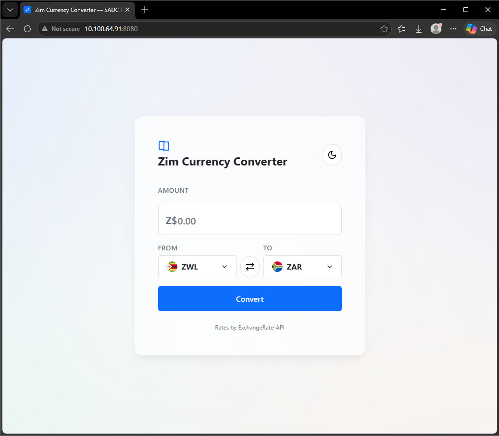
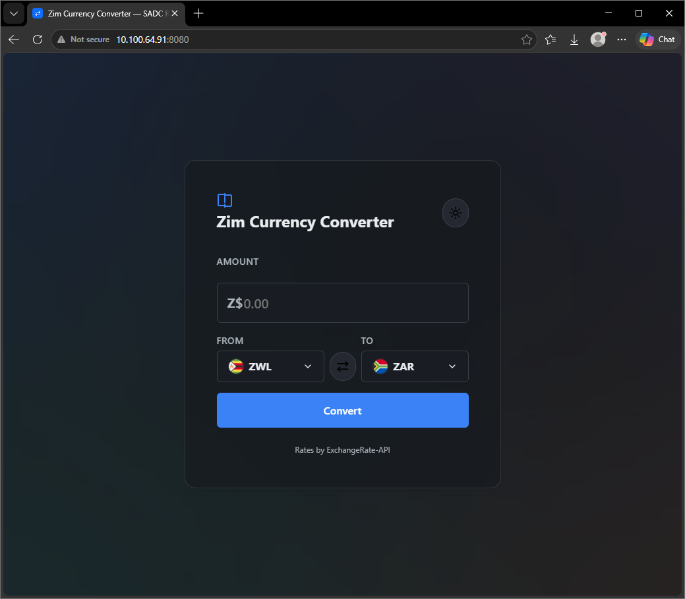

## Introduction

Zim Currency Converter is a static, vanilla‑JavaScript app (index.html, style.css, script.js) that queries ExchangeRate‑API v6 for per‑base exchange rates, caches responses for 60 seconds, and presents accessible, keyboard‑navigable custom selects. The app uses locale‑aware formatting and includes light/dark themes and in‑memory caching for snappy responses.

Note: for this demo the API key is stored in `script.js` and will be visible to end users. For production deployments, proxy requests through a backend or use provider-side restrictions to avoid exposing API keys client-side.

---

## 🚀 Live Demo

> **[gifthlahla.github.io/zim-currency-converter](https://gifthlahla.github.io/zim-currency-converter)**


---

|---|---|
|---|---|
| Structure | HTML5 (Semantic, Accessible) |
| Styling | CSS3 (Custom Properties, Flexbox, Media Queries) |
| Logic | Vanilla JavaScript (ES6+, Strict Mode) |
| API | [ExchangeRate-API](https://www.exchangerate-api.com/) (free tier) |
| Hosting | GitHub Pages |

**Zero dependencies** — no npm, no frameworks, no build tools.

---

## Screenshots

| Light Mode | Dark Mode |
|---|---|
|  |  |

---

## Project Structure

```
zim-currency-converter/
├── index.html        # Page structure & semantic markup
├── style.css         # Complete design system & responsive styling
├── script.js         # API calls, DOM logic, currency formatting
├── assets/
│   └── favicon.svg   # App favicon
├── README.md         # This file
├── SCOPE.md          # Master task checklist
├── PROGRESS.md       # Development tracking log
└── SKILL.md          # Design constitution & AI rules
```

---

## How It Works

1. Select your base currency (default: ZWL)
2. Select your target currency (default: ZAR)
3. Enter the amount to convert
4. Click **Convert** — the app fetches the live exchange rate and displays the result
5. Use the **swap button** (⇄) to quickly reverse the currency pair
6. Toggle the **theme button** (☀️/🌙) to switch between light and dark modes

---

## Review Summary

- **Implementation:** Single-file static app using `index.html`, `style.css`, and `script.js`.
- **API:** Uses ExchangeRate-API (v6) via a client-side request to `https://v6.exchangerate-api.com/v6/<API_KEY>/latest/<BASE>`.
- **Caching:** Responses are cached in-memory for 60 seconds (`CACHE_DURATION` = 60s).
- **Timeouts:** Requests abort after 10s to avoid hanging requests.
- **Defaults:** Base currency `ZWL`, target `ZAR`.
- **Accessibility:** Semantic markup, keyboard support for custom selects, and `aria-live` announcements.

---

## 🔧 Running Locally (updated)

1. Clone the repository

```bash
git clone https://github.com/gifthlahla/zim-currency-converter.git
cd zim-currency-converter
```

2. API key

- The app expects an ExchangeRate-API v6 key in `script.js` as the `API_KEY` constant.
- For quick testing you can use the built-in demo key present in `script.js`, but do NOT publish your private key in public repos for production use.
- To use your own key: open `script.js` and replace the `API_KEY` value near the top of the file.

3. Open the app

- Open `index.html` in your browser. No build tools or server required.

4. Notes on security

- This is a purely client-side app — any API key embedded in `script.js` is visible to end-users. For production use, consider proxying requests through a server or using a backend to keep keys secret, or use API restrictions provided by your provider.

---

## Supported Currencies (high level)

- The app ships with a curated list of SADC and global currencies defined in `script.js` (`CURRENCIES` array). Primary focus is regional currencies with useful global pairs (USD, EUR, GBP, CNY, JPY).

---

## Implementation Details

- `fetchRates(base)` — fetches rates for `base` and caches them for 60s.
- `CustomSelect` — accessible, searchable custom select replacement for native `<select>` elements.
- `formatCurrency` & `formatRate` — locale-aware number formatting (uses `en-ZW`).
- `handleConversion` — input validation, loading states, same-currency short-circuit, error handling.

---

## Quick Troubleshooting

- If conversions fail: check network, confirm API key validity, and ensure the target currency exists in the `CURRENCIES` list.
- If rates are stale: caching holds values for 60s by design.
- If UI appears unstyled: ensure `style.css` is loading and `index.html` references the correct path.

---

## Contribution & Next Steps

- Issues, suggestions, and pull requests are welcome. Suggested improvements include: hiding API keys via a backend, adding localStorage persistence for last-used pair, and PWA/offline support.

---

## 🔧 Running Locally

### 1. Clone the repository

```bash
git clone https://github.com/gifthlahla/zim-currency-converter.git
cd zim-currency-converter
```

### 2. Get a free API key

- Visit [ExchangeRate-API](https://www.exchangerate-api.com/)
- Sign up for a free account (no credit card required)
- Copy your API key from the dashboard

### 3. Add your API key

- Open `script.js`
- Replace `"YOUR_API_KEY"` with your actual key

### 4. Open the app

- Open `index.html` in your browser
- No build tools or server required

---

## Why This Project

This app demonstrates practical, production-ready skills:

- **API Integration** — Fetching, caching, and error-handling REST API responses
- **DOM Manipulation** — Dynamic UI updates with vanilla JavaScript
- **Design System Architecture** — 60-30-10 color rule enforced via CSS custom properties
- **Theme Engineering** — Smooth light/dark switching with system preference detection
- **Accessibility** — Semantic HTML, keyboard operability, screen-reader announcements
- **Local Relevance** — SADC currency focus with ZWL as the default, showing regional market awareness that resonates with financial and fintech employers in Zimbabwe and Southern Africa

---

## Development Workflow

This project follows a strict single-step development protocol:

- Every change is scoped to exactly one task in `SCOPE.md`
- All progress is tracked in `PROGRESS.md`
- AI agents follow the rules defined in `SKILL.md`
- Each task is tested and marked `VERIFIED` before the next begins

---

## Acknowledgements

- Exchange rates provided by [ExchangeRate-API](https://www.exchangerate-api.com/)
- Inspired by real-world currency needs in Zimbabwe and the SADC region

---
